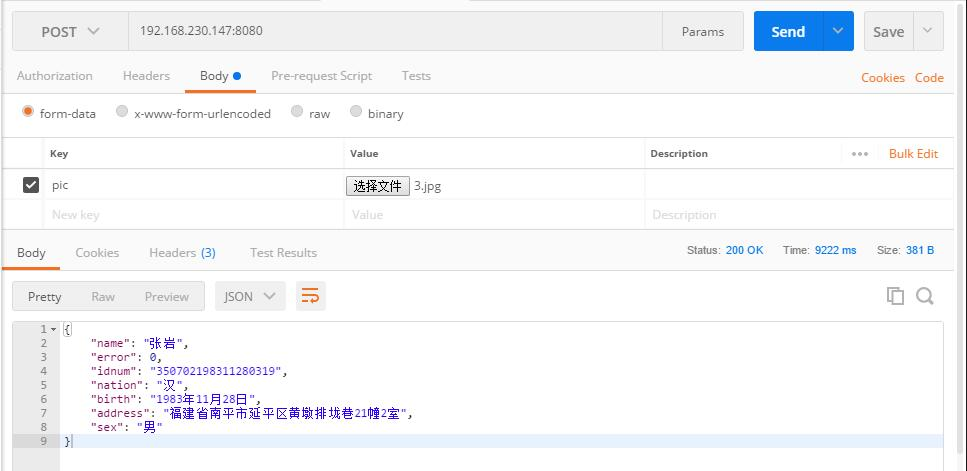

# 第二代身份证信息识别
可识别身份证上所有信息：姓名，性别，民族，出生日期，住址，身份证号码
# 依赖：
> 本项目在Ubuntu 16.04基于tesseract 3.04，OpenCV2进行开发
> ##apt依赖安装：
>`sudo apt install tesseract-ocr=3.04.01-4 tesseract-ocr-chi-sim python python-tk python-pip libsm6 libxext6` 
> ##Python依赖安装：
>`sudo pip install Pillow==5.0.0 numpy==1.14.1 opencv-contrib-python==3.4.0.12 pytesseract==0.2.0 matplotlib==2.1.2`
> ##tessdata配置：
> `sudo cp tessdata/* /usr/share/tesseract-ocr/tessdata`
# 使用方法：
> ##识别本地图片
> `import idcard_recognize;print idcard_recognize.process('testimages/3.jpg')`
> ##http_server远程接收图片
> `import idcard_recognize;
idcard_recognize.http_server()`  
> 默认监听端口为8080
>> ###测试:  
>>> ####使用curl向服务器发送图片:  
>>>`curl --request POST \
  --url http://127.0.0.1:8080 \
  --header 'content-type: multipart/form-data; boundary=----WebKitFormBoundary7MA4YWxkTrZu0gW' \
  --form 'pic=@./testimages/3.jpg'`  
>>> ####使用Postman：  
>>> 
> ##Docker运行http_server:  
> `docker build -t ocrserver .;docker run -d -p 8080:8080 http_server`  
> 测试方法同上
# 性能
> 平台： I5 6500 + 8gx2 Ubuntu 16.04  
处理单张图片时间在4秒左右（单张图片只能使用单核心）  
处理4张图片时间也是4秒左右（4核心）  
关于OPENCL: 开启并不会使单张图片处理速度加快，但是能让你在同时间处理更多图片（譬如I5 6500每秒能处理4张图片，开启OPENCL后每秒能处理6张图片）  
开启OPENCL： 默认关闭，可以自行修改`idcard_recognize.http_server`中的`cv2.ocl.setUseOpenCL(False)`开启